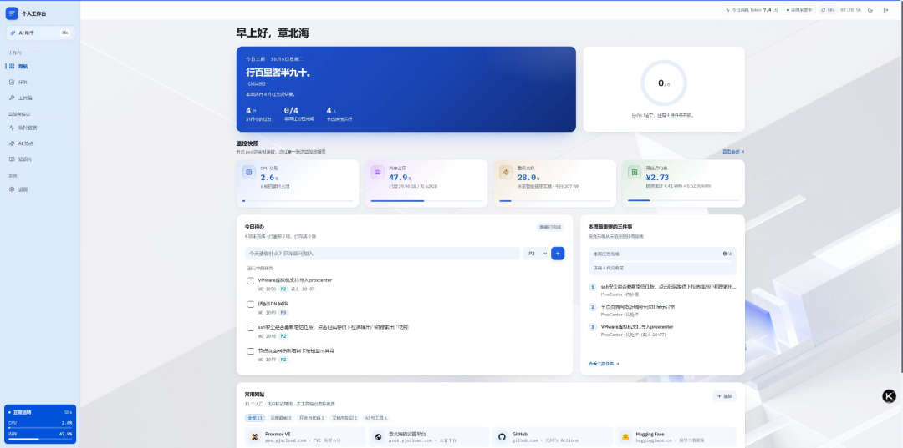

# Personal Workbench · 个人工作台

面向家庭实验室（Home Lab）的**单人控制台**：任务工单、Proxmox VE 监控、AI 热点、知识库与 AI 助手。所有数据存在自己的 MySQL 里，不依赖任何云服务。

A self-hosted, single-user console for homelab operators — tasks, Proxmox VE monitoring, AI news feed, knowledge base and an AI assistant.




## 功能一览

| 页面 | 内容 |
| --- | --- |
| **导航** | 首页搜索框（搜索引擎可在设置里增删、拖动排序）、今日待办、常用网站图标导航、本周最重要的三件事、左上角 AI 助手入口 |
| **任务** | 清单筛选 + 列表/看板双视图 + 任务详情抽屉，支持归档与回收站 |
| **监控数据** | Proxmox VE 主机指标（CPU / 内存 / 磁盘 / IO / 容量趋势 / 温度）、整机功耗与电费（接 [Home Assistant](#依赖说明home-assistant可选) 后为实测值）、节能模式 |
| **AI 热点** | 每日自动抓取的 AI 资讯流，带模型打分与推荐理由 |
| **工具箱** | 工具网站按用途分类，支持搜索与增删改、自定义上传图标，分类可拖动排序或按名称自动排列，与首页共用一份数据 |
| **知识库** | SOP + Runbook，按类型与标签区分 |
| **设置** | 主题与强调色、PVE 连接、功耗电价模型、搜索源、数据备份 |

## 部署

### 前置要求

- **Node.js 20+**
- **MySQL 8**
- **Home Assistant**（可选）—— 只为读取智能插座的真实功耗，不配也能跑，功耗改用估算模型。见下方[依赖说明](#依赖说明home-assistant可选)

### 1. 建库建账号

```bash
mysql -uroot -p < server/db/bootstrap.sql
```

会创建 `personal_workbench` 库与 `workbench` 账号。

### 2. 安装依赖并配置

```bash
npm install
cp .env.example .env
```

编辑 `.env`。**只有 MySQL 连接是必填的**，其余留空即可跑起来 —— 没配 Proxmox 时自动进入演示模式，用模拟数据把界面跑通。

### 3. 启动

开发模式（前端热更新 + 后端自动重启）：

```bash
npm run dev
# 前端 http://localhost:5173   后端 http://localhost:8787
```

生产模式（单端口，前端产物由后端托管）：

```bash
npm run build
npm start
# http://localhost:8787
```

首次启动会自动建表并写入示例数据。

### 4. 常驻运行（可选）

`/etc/systemd/system/personal-workbench.service`：

```ini
[Unit]
Description=Personal Workbench
After=network.target mysql.service

[Service]
Type=simple
WorkingDirectory=/opt/personal-workbench
ExecStart=/usr/bin/node server/index.js
EnvironmentFile=/opt/personal-workbench/.env
Restart=always
RestartSec=5

[Install]
WantedBy=multi-user.target
```

```bash
systemctl daemon-reload
systemctl enable --now personal-workbench
```

> **放在 nginx 后面时**：若用 AI 助手的流式问答，`proxy_read_timeout` 必须大于 `AI_TIMEOUT_MS`，
> 否则连接会先被反代掐断，前端只能收到 504。另外 `index.html` 不要设长缓存
> （`/assets/` 下的文件带哈希，长缓存是安全的）。
>
> 还有一处**必须单独放行**：书签图标的地址要允许长缓存，它的语义和 `/api/` 的 `no-store`
> 正好相反。漏了这一步，每次刷新每个磁贴都要重新下载一遍图标，界面上就是"图标闪一下"
> （地址带内容版本号，所以长缓存是安全的）。它得写成正则、放在 `/api/` 之前才对得上：
>
> ```nginx
> location ~ ^/api/bookmarks/[^/]+/icon$ {
>     proxy_pass        http://127.0.0.1:8787;
>     proxy_set_header  Host $host;
>     # 上游会发自己的 Cache-Control，丢弃后只保留下面这个（否则会叠成两个头）
>     proxy_hide_header Cache-Control;
>     add_header Cache-Control "public, max-age=31536000, immutable" always;
> }
> ```

## 环境变量

完整清单和注释见 [`.env.example`](.env.example)。常用的几组：

| 变量 | 说明 |
| --- | --- |
| `DB_HOST` `DB_PORT` `DB_USER` `DB_PASSWORD` `DB_NAME` | MySQL 连接（**必填**） |
| `PORT` | 服务端口，默认 `8787` |
| `AUTH_USER` `AUTH_PASSWORD` | 面板登录账号；`AUTH_PASSWORD` 留空即关闭登录 |
| `PVE_HOST` `PVE_TOKEN_ID` `PVE_TOKEN_SECRET` | Proxmox VE 连接，留空走演示模式 |
| `HA_URL` `HA_TOKEN` | Home Assistant，读取智能插座的真实功耗（可选，见[依赖说明](#依赖说明home-assistant可选)） |
| `AI_BASE_URL` `AI_API_KEY` `AI_MODEL` | 任意 OpenAI 兼容端点（官方 API / Ollama / vLLM 均可） |
| `HERMES_BASE_URL` | 局域网 Hermes Agent Office 网关（可选） |

## 依赖说明：Home Assistant（可选）

**整机功耗与电费默认是估算出来的**，想拿到真实读数就要接 Home Assistant —— 通过智能插座读实测功率。

不配 HA 时，功耗走「CPU 利用率 → 功耗」的工程估算模型；配上之后：

- **整机功耗** = 各插座实测功率之和
- **用电量与电费** = 对上面的求和功率做积分，按电价折算（也可读插座自带的累计电量实体）

### 配置步骤

1. 在 Home Assistant 生成长期访问令牌：**左下角头像 → 安全 → 长期访问令牌**
2. 写进 `.env`：

   ```bash
   HA_URL=http://127.0.0.1:8123
   HA_TOKEN=你的长期访问令牌
   ```

3. 到 **设置 → 功耗 → 插座列表** 添加插座：每个插座填一个**功率实体**（如 `sensor.plug_electric_power`），
   可再加一个**累计电量实体**，留空则由服务端对功率做积分。支持多个插座，整机功耗是它们的和。

### 几点说明

- **令牌只从环境变量读取**，不落库、也不进备份导出；设置页只显示「已配置 / 未配置」，不会回显令牌本身。
- `HA_POWER_ENTITY` / `HA_COUNTER_ENTITY` 是旧版单插座配置的兜底，仅当插座列表为空时才会被读。
- 电量累计依赖服务持续运行，**停机期间不补算**（避免虚增）。
- 没接 HA、或插座读不到数时，界面会明确标注数据来源，不会拿估算值冒充实测。

## 数据存储

所有数据都在 **MySQL**，不落本地文件。表结构见 [`server/db/schema.sql`](server/db/schema.sql)，服务启动时自动执行（幂等），也可以单独跑：

```bash
npm run db:migrate      # 只建表 / 检查连通性与各表行数，不启动 Web 服务
```

写请求在返回前会等待 MySQL 事务提交，提交失败返回 503 —— 不会出现「界面提示保存成功、库里其实没写」。设置页支持导出 / 导入 JSON、立即落盘与重置为示例数据。

> 内存镜像是写入源头，所以**手工改库之后要重启一次服务**，否则下一次同步会覆盖掉手工改动。通过界面或接口读写不会有这个问题。

## 目录结构

```
server/          Express 服务
  index.js       入口、落库闸门、静态托管、定时任务
  routes.js      全部 REST 接口
  store.js       数据层：内存镜像 + 写穿 MySQL
  seed.js        示例数据
  db/            建库建表、连接池、事务化落库
  services/      PVE 客户端、功耗模型、热点抓取、AI 助手
src/             React 前端
  components/    外壳、AI 助手、UI 基础件
  pages/         七个页面
  lib/           API 客户端、全局 store、主题
docs/            截图
```

## 已知边界

- 演示模式下监控数值由时间驱动的确定性算法生成，用于跑通界面，**不代表真实硬件**；
- 磁盘 IO 与温度依赖 PVE 节点侧的 `lm-sensors` / SMART 配置，缺失时界面标注「未探测到」而非补零；
- 电量累计依赖服务持续运行，停机期间不补算；
- **AI 热点的数据来自第三方公开接口 [AIHOT](https://aihot.news)**。个人自用没问题；对外商用或公开再分发前，请先确认其使用条款。

## License

[MIT](LICENSE)
